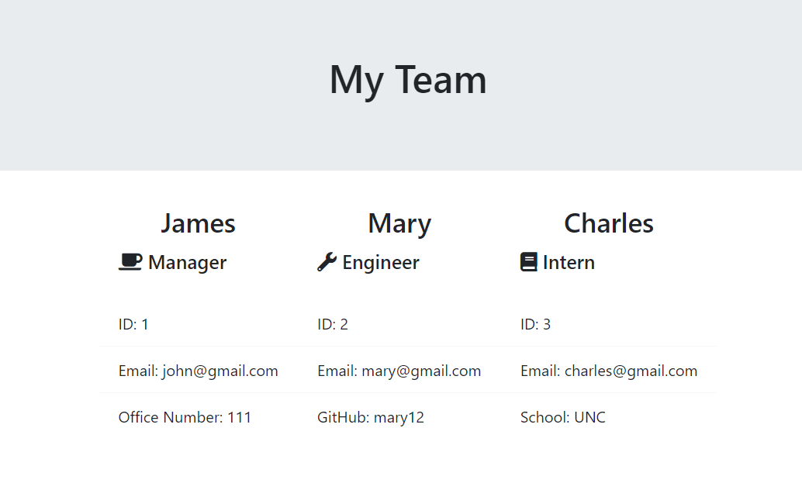

# Team Generator

## Table of Contents

* [General Info](#general-info)
* [Technologies](#technologies)
* [Features](#features)
* [How to Use](#how-to-use)
* [Application Demo](#application-demo)
* [Application Link](#application-link)
* [Contact](#contact)

## General Info

A software engineering team generator command line application. The application will prompt the user for information about the team manager and then information about the team members. The user can input any number of team members, and they may be a mix of engineers and interns. When the user has completed building the team, the application will create an HTML file that displays a nicely formatted team roster based on the information provided by the user.

## Technologies

* HTML
* JavaScript
* Inquirer
* Jest
* Node

## Features

* Using Node, this application allows the user to enter information first for a manager, then for additional team members
* User is able to select additional team members (Manager, Engineer, or Intern) or select None
* Once the user selects None, a file containing all of the team members is generated

## How to Use

After downloading the code, open Node and enter the manager information. After this information has been entered, select Manager, Engineer, Intern, or None. Selecting none will generate the roster.

## Application Demo

## Application Link

https://github.com/joneskm72/template-engine

## Contact

* Email: jones.m.kasey@gmail.com

* GitHub: https://github.com/joneskm72
